当我们在 Blocklet Server 创建一个站点后，Blocklet Server 会自动给该应用分配一个可以访问的地址；同时，用户也可以给这个应用绑定一个自定义的域名，以及给这个站点启动 SSL.

## 绑定域名

### 添加 DNS 解析

绑定域名的前提是该域名已经解析到该节点所在的服务器，这个需要用户在自己域名所在的域名服务商进行解析。

### 在 Blocklet Server 中绑定

#### 添加站点

1. 打开`服务网关 > URL 映射`页面, 点击`添加站点`

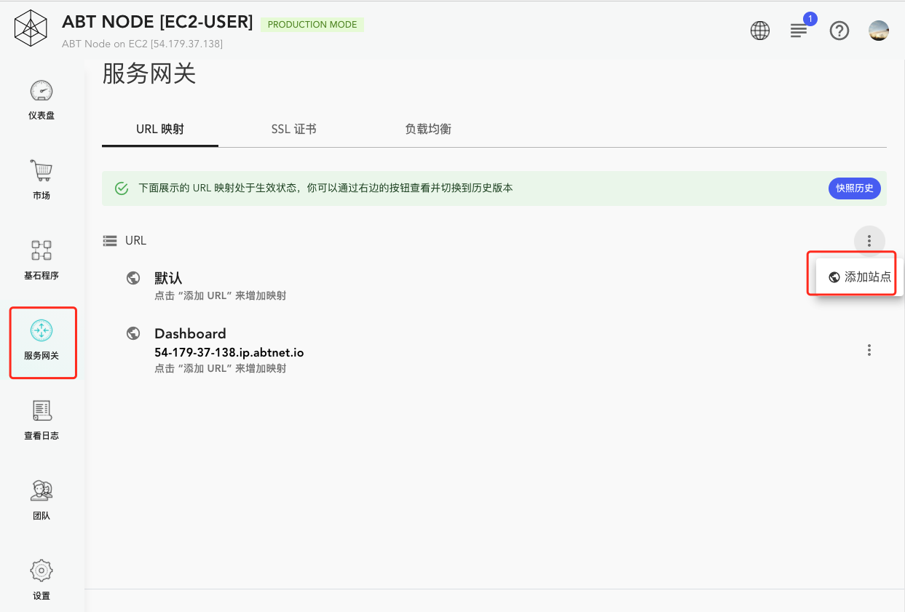

2. 填写域名

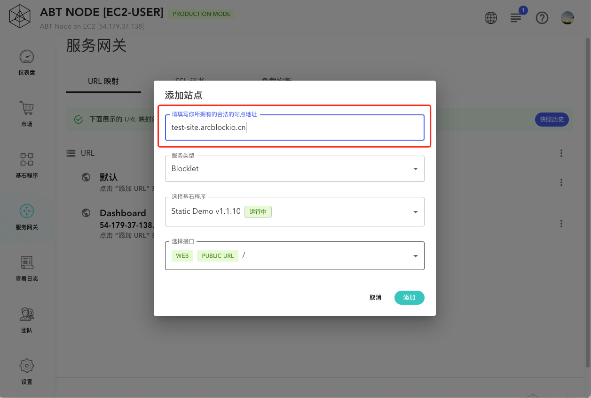

3. 部署

点击`部署 URL 映射`按钮，然后填写信息，应用路由规则:

部署 URL 映射：

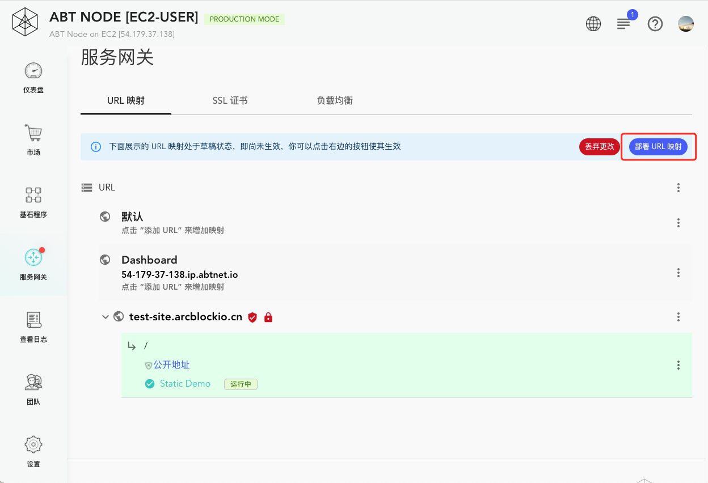

填写信息：

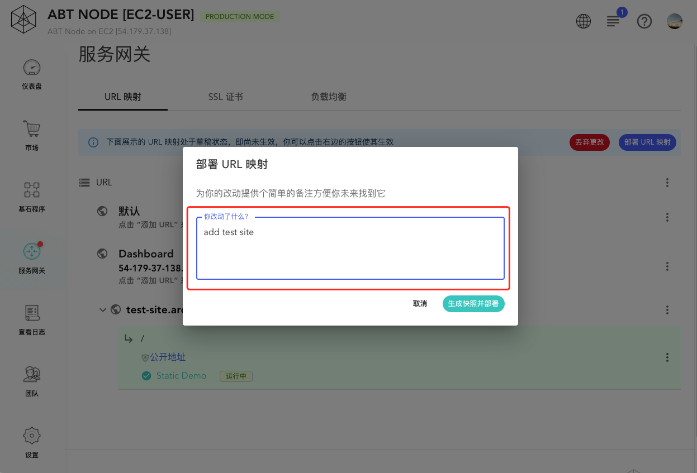

#### 完成

如果一切正常，这个时候站点就可以访问了。

点击网站链接：

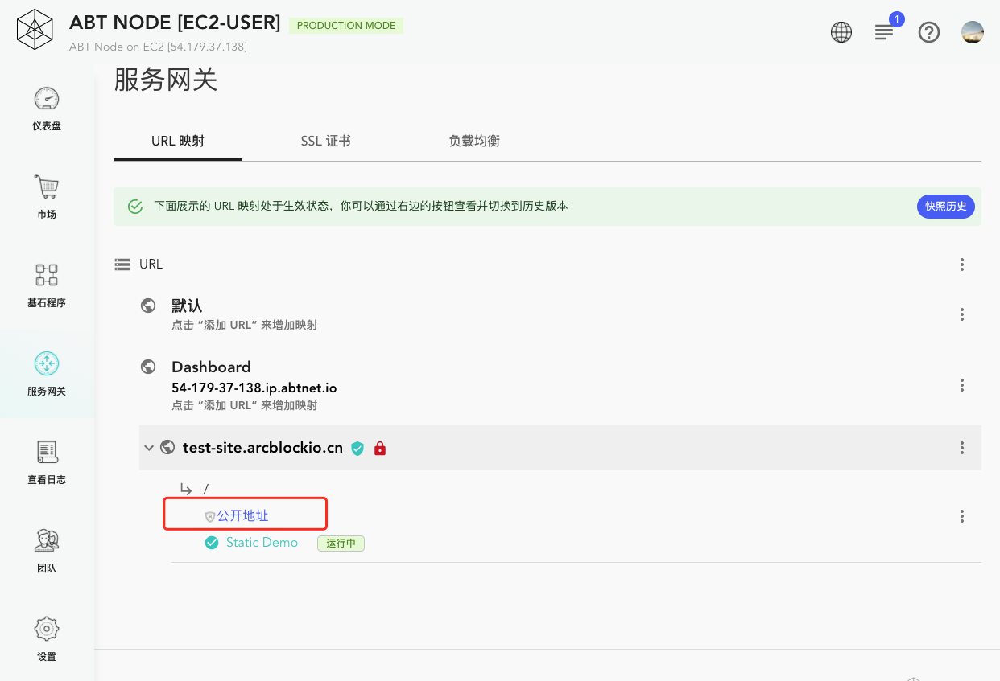

站点：


## 启动 SSL

当我们的站点已经运行的时候，我们应该给这个站点添加一个 SSL 证书，让网站更安全。Blocklet Server 提供了两种添加 SSL 证书的方式，分别是用户自己上传和使用 Certificate Manager Blocklet 创建免费的证书。

### 自己上传

1. 进入`服务网关 > SSL 证书`页面

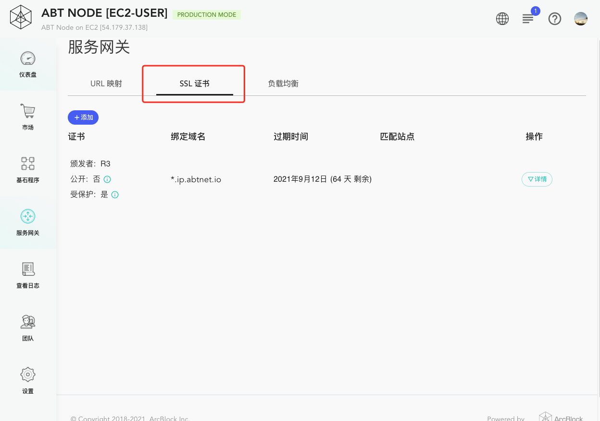

2. 上传证书和私钥

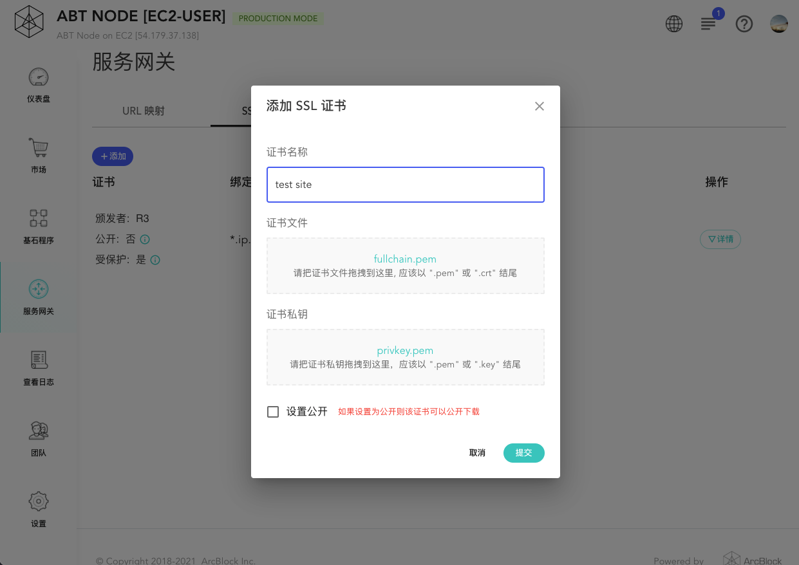

3. 完成

添加完成后，访问站点，我们就可以看到站点已经是 HTTPS 的了:

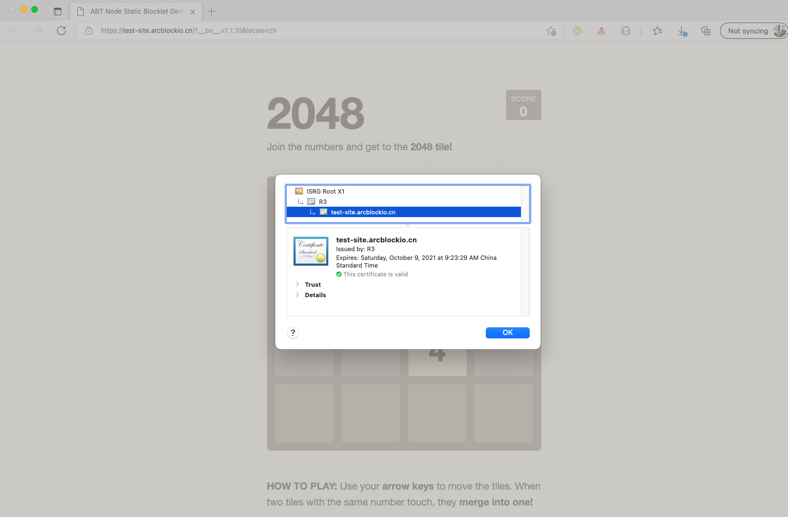

### 使用 Certificate Manager 创建免费的 Let's Encrypt SSL 证书

这是我们推荐的方式。使用这种方式可以非常方便的给一个站点添加一个免费的 SSL 证书。

1. 安装 Certificate Manager Blocklet
2. 配置 Certificate Manager

```
  - `NODE_ACCESS_KEY`: 在 Blocklet Server 中生成的 NODE_ACCESS_KEY, Certificate Manager 用来上传证书用的
  - `NODE_ACCESS_SECRET`: 在 Blocklet Server 中生成的 NODE_ACCESS_SECRET, Certificate Manager 用来上传证书用的
  - `NODE_DOMAIN`: 节点地址，用来显示提示信息
  - `MAINTAINER_EMAIL`: 维护者的邮箱，用来接收证书相关的邮件
```

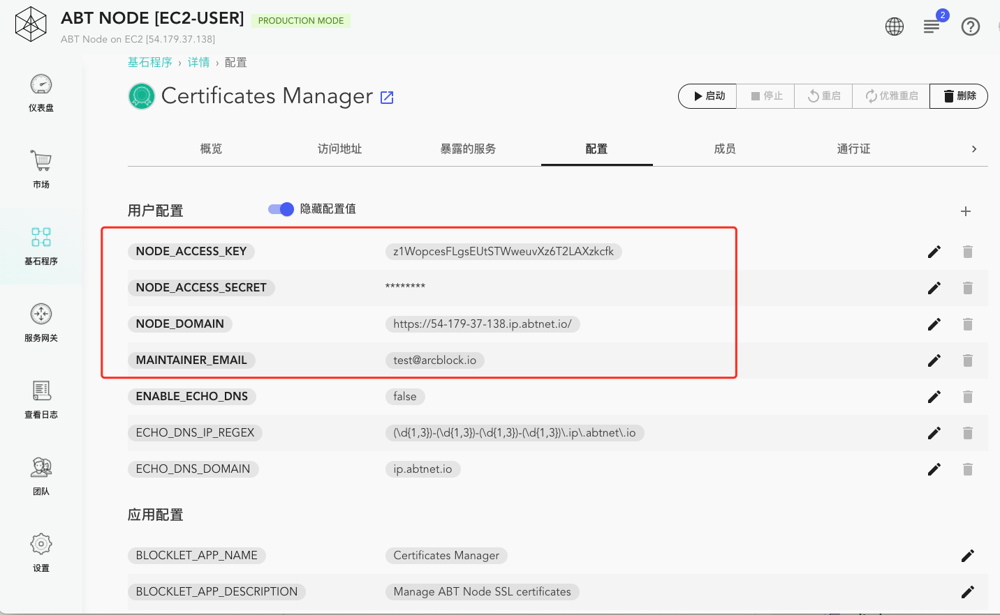

3. 启动 Certificate Manager
4. 访问 Certificate Manager, 并登录

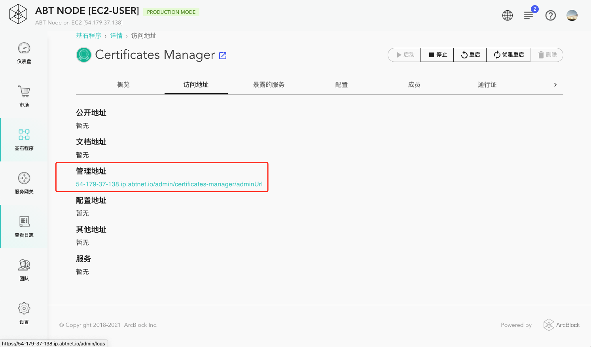

5. 添加需要的域名，为该域名生成证书

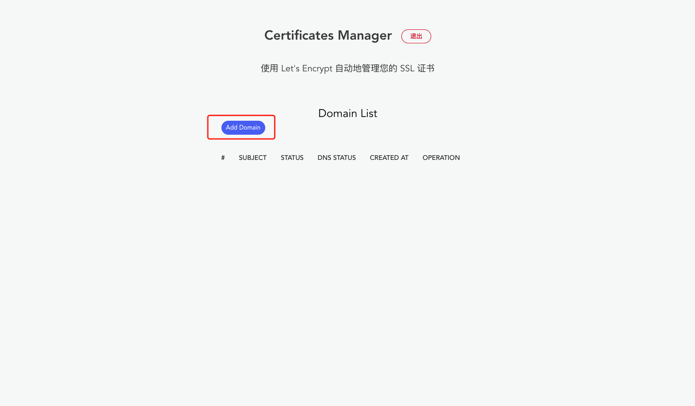

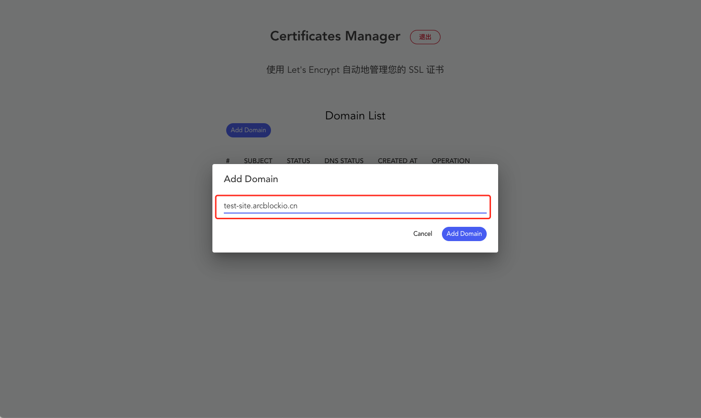

等待生成证书：

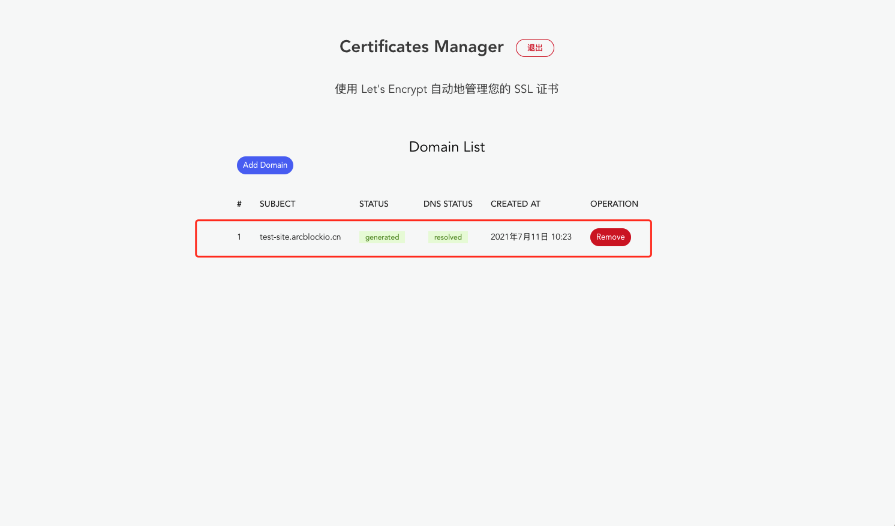

6. 自动绑定证书

Certificate Manager 会自动将证书绑定到站点，如果一切正常，这个时候站点就已经是 HTTPS 的了:


