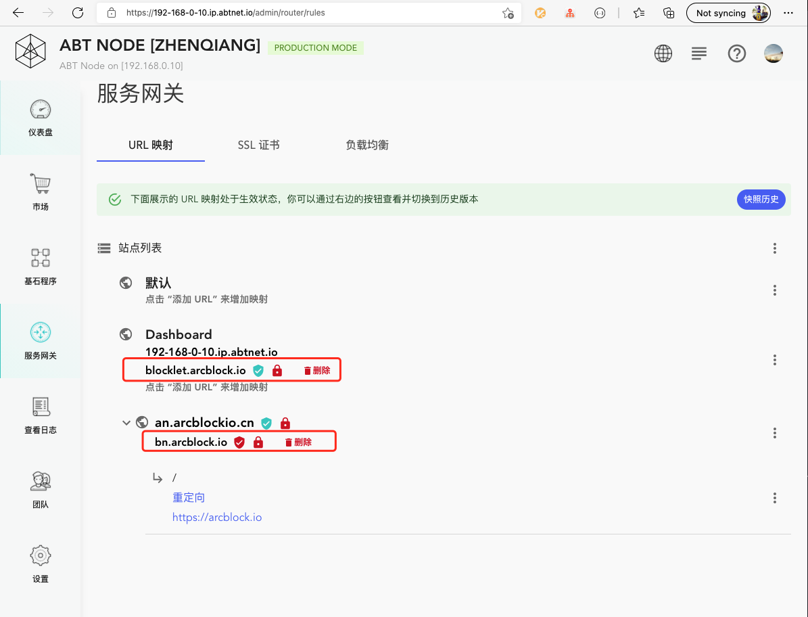
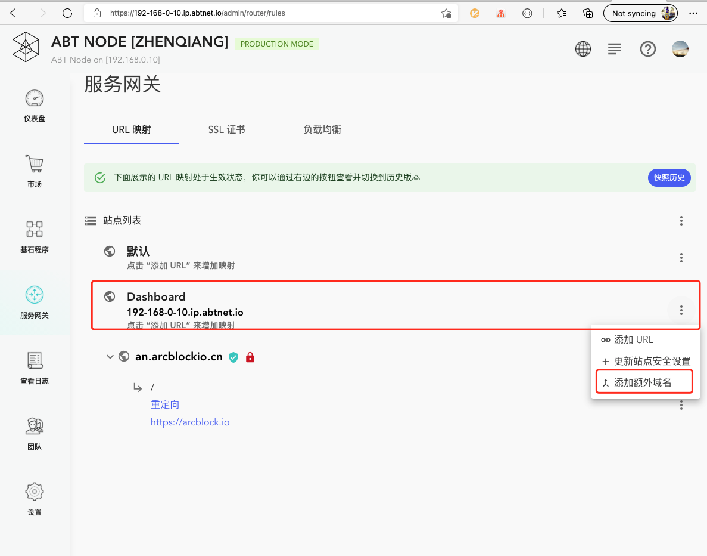
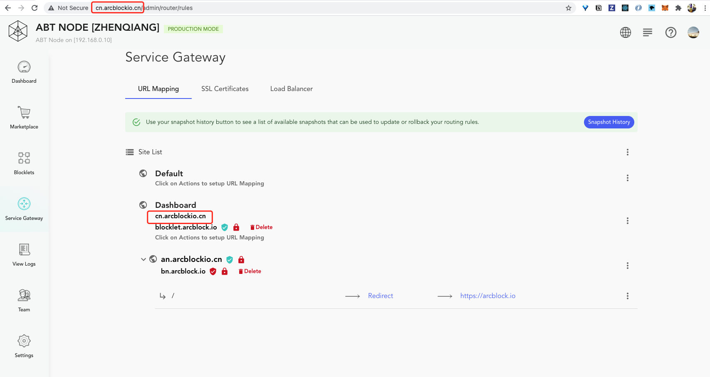
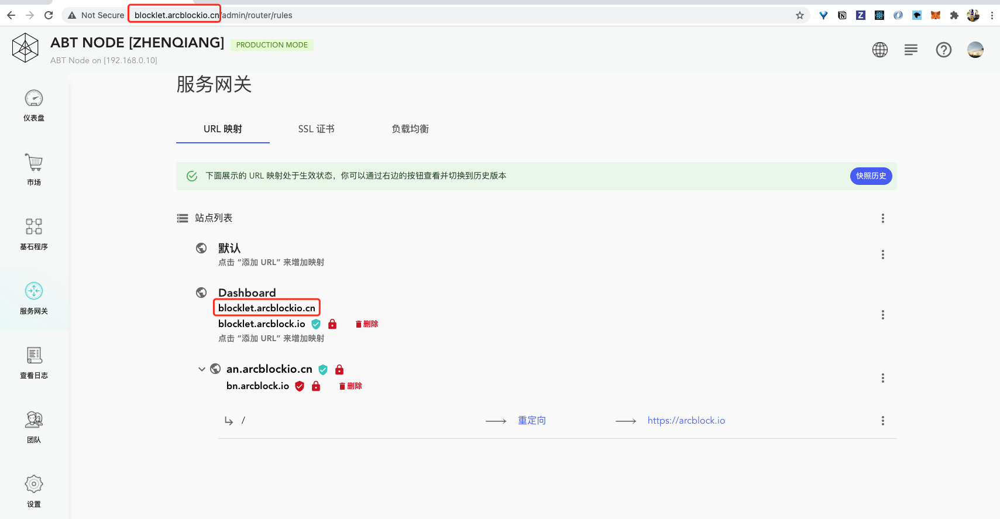

Blocklet Server 会为每一个节点分配一个 HTTPS 地址: `https://{public IP}.ip.abtnet.io`, 比如: 如果 IP 是 192.168.1.100, 那么这个地址就是: `https://192.168.1.100.ip.abtnet.io`. 但是在更多的情况下这个域名并不能满足需求，这个时候我们可以通过给节点添加 `额外域名` 的方式来绑定自定义域名。

## 额外域名

在 Blocklet Server 中可以给一个站点或者节点本身绑定多个域名，除了站点(节点)原有的域名以外的所有域名都叫做`额外域名(Additional Domain)`. 比如下图中的 `blocklet.arcblock.io` 和 `bn.arcblock.io` 都是额外域名:

## 自定义节点域名

1. 点击 Dashboard 右侧的操作列表

2. 然后再点击`添加额外域名`:

3. 然后在弹出的输入框中输入域名

4. 最后应用路由: 点击部署 URL 映射

这就是给节点自定义域名的方法，添加完成后就可以使用该域名访问节点了。如果需要启动 HTTPS, 可以参考: [给站点绑定域名以及启用 SSL](/settings/router/bind-domain-and-ssl).

## 注意

给节点或者站点添加额外域名的时候有两点需要注意：

1. 在路由列表中会展示当前访问地址的域名. 比如下图中的`cn.arcblockio.cn`并不是节点的域名，也不是节点的额外域名，但是因为当前节点是使用`cn.arcblockio.cn`访问的，所以这里也会展示。此外，这个域名虽然列在了这里，但是并不影响添加为额外域名。

2. 不能删除当前访问域名的额外域名。比如下图中的 `blocklet.arcblock.io` 是节点的额外域名，并且是使用这个域名访问的节点，那么不能在这个时候删除删除 `blocklet.arcblock.io`:

