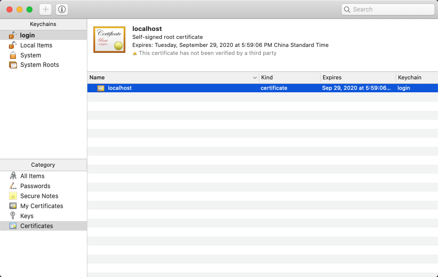
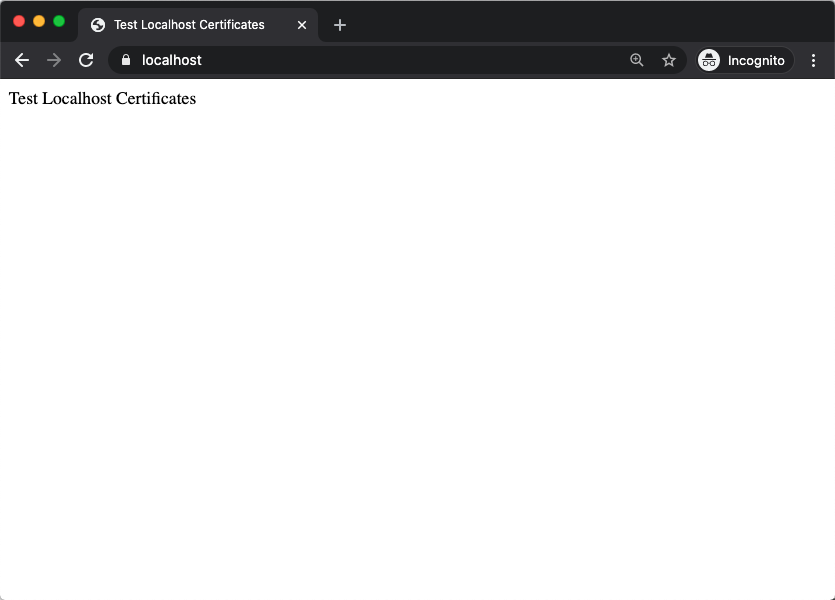

To help you with your local development and testing, it is very easy to generate a local certificate. Outside of the machine you are currently developing on, the certificate will not be trusted by anyone else, which is sufficient for development.

## Use OpenSSL to generate localhost certificate

To start we wil use `openssl` to generate the certificate. Use the following command:

```bash
openssl req -x509 -out localhost.crt -keyout localhost.key \
  -newkey rsa:2048 -nodes -sha256 \
  -subj'/CN=localhost' -extensions EXT -config <( \
   printf "[dn]\nCN=localhost\n[req]\ndistinguished_name = dn\n[EXT]\nsubjectAltName=DNS:localhost\nkeyUsage=digitalSignature\nextendedKeyUsage=serverAuth")
```

## Test Certificate

After the certificate is generated, we can test it with Blocklet Server's NGINX using the configuration below:

**Replace \<your directory\> with the real directory**

```nginx
worker_processes auto;

events {}

http {
    server {
        listen 443 ssl;
        server_name localhost;

        ssl_certificate <your directory>/localhost.crt;
        ssl_certificate_key <your directory>/localhost.key;

        root <your directory>/localhost-certificates;

        location / {
          index index.html;
        }
    }
}
```

Then enter `https://localhost` in the browser:


In the image, we can see that there is a problem with the certificate (In Safari users you will see 'Safari Can't Open the Page'), because the certificate is not yet trusted by the system at this time.  So, then ext step is to tell the system to trust the certificate.

## Trust Certificate (Mac OS)

After the certificate is generated, it cannot be used directly; you need to **trust** the newly generated certificate on your device. For this example Let's use Mac OS.

The generated certificate is in the current directory, double-click the `localhost.crt` file in the file manager (Finder):


After double-clicking, the setting page of `Keychains Access` will appear, then double-click the `localhost` certificate:



After double-clicking the certificate, in the settings of `Trust`, set `When using this certificate` to `Always Trust`:


Then click the `Close` button in the upper left corner, before the window is closed, the system will prompt to save the settings, enter the password to save the settings:


Now revisit `https://localhost` in the browser. We can now see that the test website can be accessed normally:



Complete the settings.

## SSL Certificates

You can add SSL Certificate files to your Blocklet Server using your SSL Certificate File and Private Key Files to secure services on your node. Today, Blocklet Server supports single domain SSLs and Wilcard SSLs to protect a domain (arcblock.io) and all its related subdomains (test.arcblock.io, shop.arcblock.io, etc). Blocklet Server does not support partial or multi-domain wildcard SSLs at this time. Please confirm with your SSL provider on the best SSL type for your project and not all types of certificates are supported. Developers can also leverage Letsencrypt self-signed [Certificates for localhost](./certificates-for-localhost).

## Reference

-[Let's Encrypt] localhost certificate: https://letsencrypt.org/docs/certificates-for-localhost/
