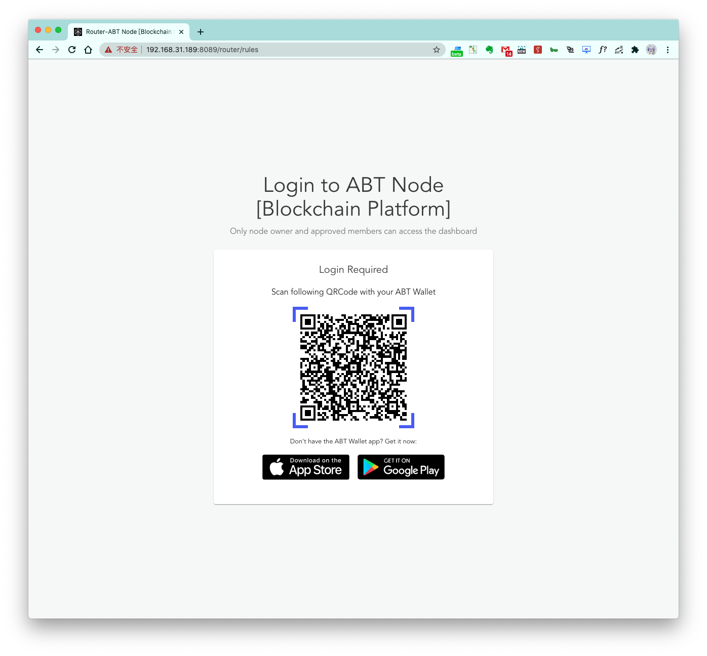
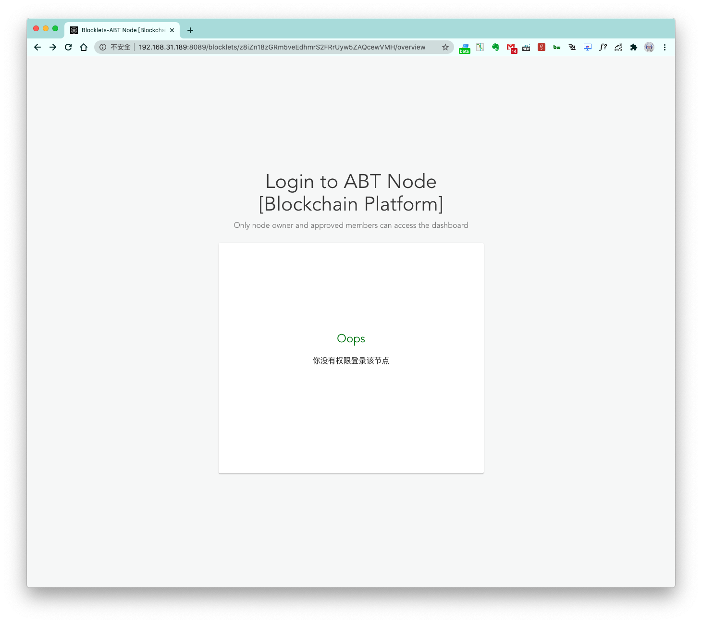
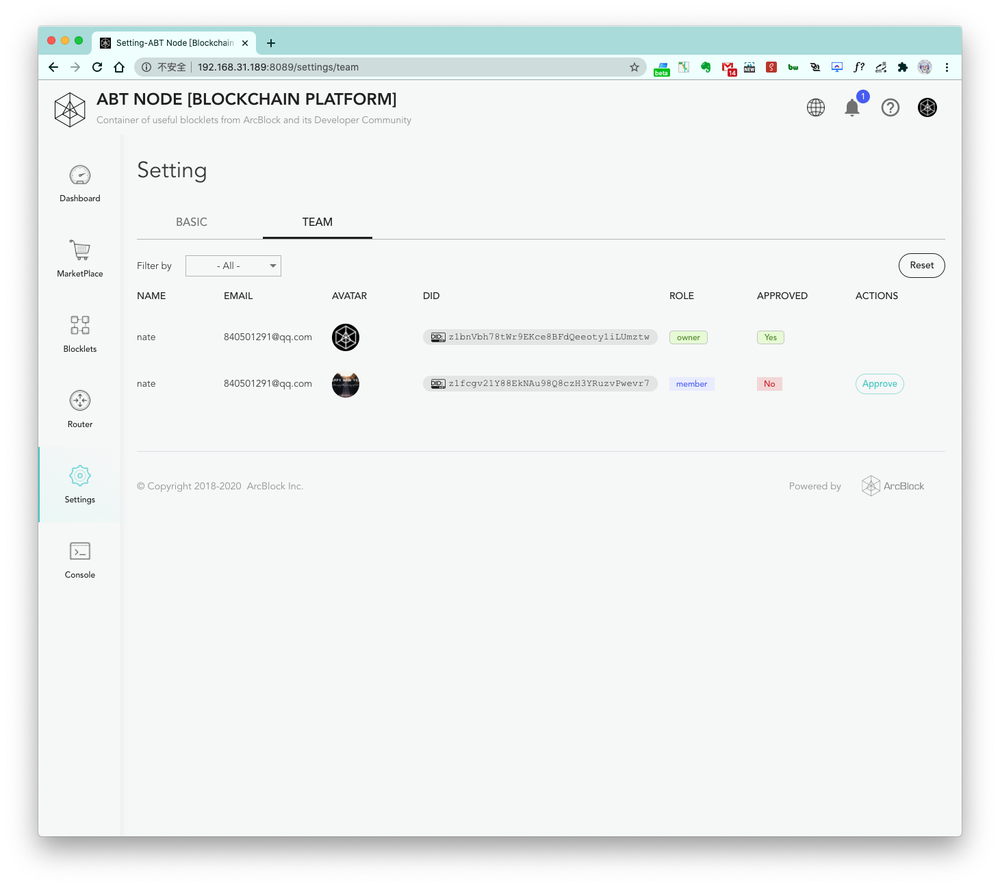

> 
This page is outdated and must be updated

Current members of an Blocklet Server can invite other users as members to the Blocklet Server, and the node owner can manage member permissions
on by issue or revoke member passports.

## View Members

## Invite New Member

## Revoke Existing Member

## Manage Member Access

To invite a new member, the new member should have [DID Wallet](https://abtwallet.io/en/) set up on his or her phone.

Then, the new member would scan the QR code on the Blocklet Server's site.

A message will appear indicating that the new member does not have the permissions to log into the node.

The owner of the node could see the sign-in attempt in the `TEAM` page:

A new `member` that is not approved would appear in the list of members. Click the `Approve` button to add the new user.
The new member can now access the node by scanning the QR code again.

> You can also go to this page to cancel the member's access rights by clicking the `Reject` button after adding the
> member.
