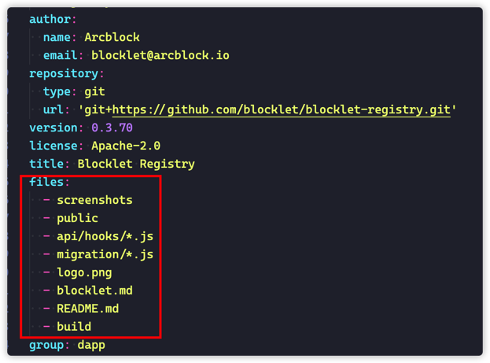

## 发布步骤

1. 确保你的 Blocklet 可以打包并部署到你的本地 Blocklet Server 
2. 去 [blocklet store](https://store.blocklet.dev/) 或者 [blocklet store(dev)](https://dev.store.blocklet.dev/) 注册开发者账号
   - 需要先申请成为一个开发者，待管理员审核过后，才能进行后面的步骤
3. 进入访问密钥页面，新建一个访问密钥
4. 在主机中配置发布 blocklet store 相关配置
   - 使用 `blocklet config set store [storeUrl]` 命令配置需要发布的目标 Blocklet Store
   - 使用 `blocklet config set accessToken [accessToken]` 命令配置访问密钥（访问密钥为上一步中在管理端中获取到的）
5. 开发一个 Blocklet 完成后，使用 `blocklet upload` 命令进行上传应用
   - 推荐使用 [create-blocklet](https://www.npmjs.com/package/create-blocklet) 工具来快速创建一个 Blocklet
   - 通常来说，在 `blocklet upload` 之前还需要对 blocklet 进行 `bundle`
6. 登录到上传的 Blocklet Store，可以在 “应用” 页面看到刚刚上传的 Blocklet
7. 此时 Blocklet 上传的新版还处于 “草稿” 状态，需要点击发布按钮，进行发布
8. 在 Blocklet 仓库中进行验证: [blocklet store](https://store.blocklet.dev/) 或者 [blocklet store(dev)](https://dev.store.blocklet.dev/)
9. 在市场中验证：从市场安装你的 Blocklet 到你的 Blocklet Server 

## 发布配置

- `files`: 定义哪些文件会被发布
