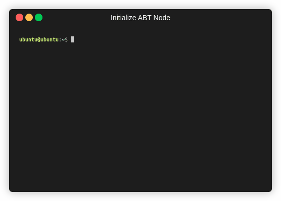

要使您的 Blocklet Server 启动并运行，您必须对其进行初始化。在初始化节点之前，请确保已经初始化了节点连接到您希望节点所在的网络。如果希望您的节点可以通过 Internet 访问，请确保你连上了互联网。如果使用了虚拟机，请使用桥接网络适配器 (如果端口转发被启用 NAT 网络适配器也可以工作) 或附加一个外部无线卡到虚拟机。

另外，如果您已经初始化了 Blocklet Server ，你可以用 `blocklet server start` 开始您的节点，或者您可以重新初始化 Blocklet Server ，通过删除配置文件 (如果数据使用默认值目录和配置文件则使用 `rm -r ~/.abtnode` 即可)。

运行下面的命令即可初始化 Blocklet Server ：

```bash
blocklet server init
```

然后，填充每个字段（或留空，默认为带括号的值）。当你选择 IP 地址时，如果只是在局域网测试节点，请使用本地 IP 地址，或者如果您希望您的节点可以通过 Internet 访问， 请选择公共 IP 地址。

<details>
<summary>输出示例</summary>



</details>

现在，您需要启动节点才能使用它。要启动您的节点，运行以下命令：

```bash
blocklet server start
```

<details>
<summary>输出示例</summary>

<!--  -->

</details>

然后，在浏览器中打开输出链接。浏览器可以在其他设备上，只要该设备是打开的可以连接到节点。然后用您的 ABT 钱包扫描登录二维码，使您成为该节点的所有者请确认进入 Blocklet Server 。

如果您想要停止节点，运行以下命令：

```bash
blocklet server stop
```

<details>
<summary>输出示例</summary>

<!--  -->

</details>
