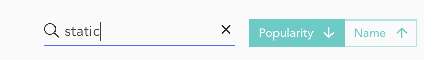
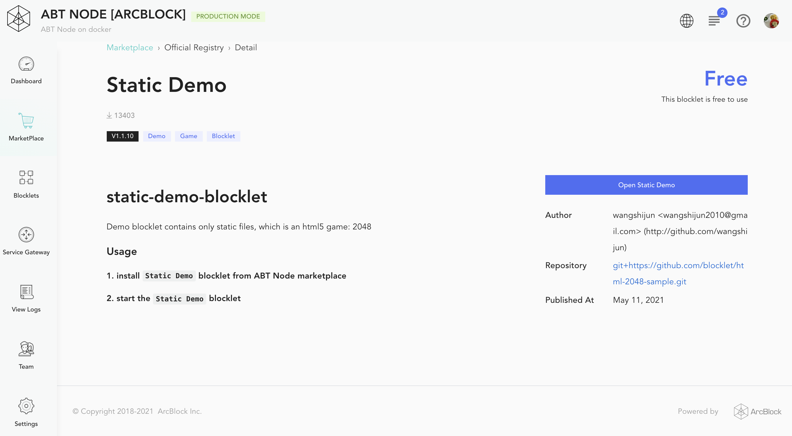
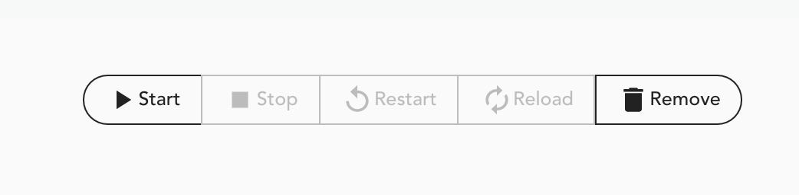
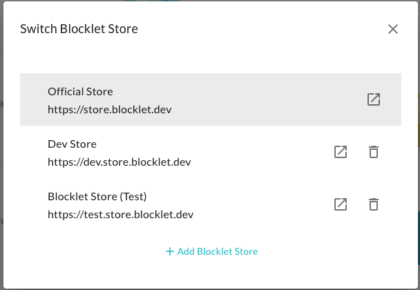

## Find a Blocklet

To get started, go to the left-hand action bar and click on **Store**. It will display a catalog of Blocklets created by the ArcBlock community. Blocklets are shown with details like the latest release version, release date, install count, and project tags. You can sort the catalog by _popularity_ or by _name_. Additionally, a _search_ box is also provided to filter Blocklets based on their name and description.

## Review a Blocklet

The Store dashboard shows Blocklet summary, which can serve your selection criteria. But while working with a blocklet you must determine its setup guide, environment configurations, license, etc. All these details are provided on the details page hosted on the original store. Click on a particular blocklet will open its details page.

## Install a Blocklet

Installing a Blocklets is quite easy. Find a Blocklet you want to add to your Blocklet Server and click on the _Launch_ button. It will take sometime to complete the installation.

Once the installation is complete, the store dashboard will confirm this with a notification message. The Blocklet _Launch_ button will also change to _Open_ button.

The installation process does not start the Blocklet. You have to access the [Blocklet Management console](/en/blocklet) for starting/stopping/configuring the Blocklet. Please refer to the Blocklet details page for associated instructions.

\_Note, some Blocklets may require additional configuration to work correctly, so be sure to check your configuration details if additional steps are required.

## Multiple Blocklet Stores

Blocklet server has the following 2 blocklet stores hosted by ArcBlock by default:

1. [Official Store](https://store.blocklet.dev): It provides hosting for production-ready blocklets for the end-user.
2. [Dev Store](https://dev.store.blocklet.dev): It provides sample/demo blocklets for developers to learn the blocklet framework.

You can add a custom store by clicking **Add Blocklet Store**. You will need to provide a URL for the custom store.
