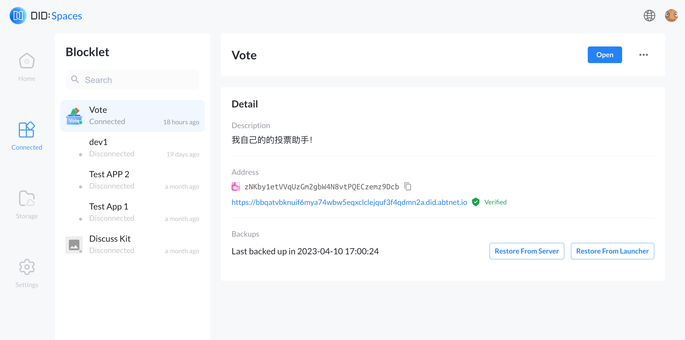

Blocklet Server 1.16.0 is officially released. This update puts the application concept at the core, and comprehensively upgrades Blocklet from the aspects of application DID management, asset management, data backup, application migration, and application structure. We aim to provide a more intelligent, flexible, secure and convenient application experience, allowing users and developers to be more free to be creative and focus on creation. The following is the specific content of this update.

> Get the latest version of Blocklet Server
> 1. Via [Blocklet Launcher](https://launcher.arcblock.io/)
> 1. If you are a developer, you can also get it through `npm install -g @blocklet/cli`. Refer to [Getting Started Guide](https://developer.blocklet.io/docs/en/quick-start)

## Application DID management integration to DID Wallet

Our latest upgrade integrates DID management of applications into [DID Wallet](https://www.didwallet.io/), allowing users to manage their own applications and on-chain assets more easily and securely. Now, you can easily control your digital life with [DID Wallet](https://www.didwallet.io/), so you can use blockchain applications with more confidence and peace of mind.

## Backup and migrate apps using DID Spaces

We have brought the [DID Spaces](https://www.didspaces.com/) for users, which allows users to back up their applications to [DID Spaces](https://www.didspaces.com/), and easily migrate applications to another Blocklet Server when needed. It even allows users to directly back up application data to [DID Spaces](https://www.didspaces.com/) without being aware of the existence of Blocklet Server, and then directly deploy the application to a serverless environment. This improvement will greatly enhance the user's application management and migration experience, making users feel relaxed and happy.

## Application structure upgrade

We have also upgraded the application structure. The new application structure improves the composability, stability and performance of the application, creating a more flexible application combination experience for you. You can now modify the mount point of any component, delete any component, easily achieve personalized needs, and create more freedom.

> To take advantage of these improvements in your running application, you need to [migrate your application](https://www.arcblock.io/blog/en/post/2023/04/04/migrate-blocklet-guide).

## Blocklet software DID management integrated into DID Wallet

We are committed to providing developers with a more convenient development and management experience. Our latest upgrade integrates the DID management of Blocklet software into [DID Wallet](https://www.didwallet.io/), making it easier for developers to view the revenue from selling and sharing their software, helping developers to focus on creating and optimizing their Blocklets. Let [DID Wallet](https://www.didwallet.io/) become a powerful assistant for developers to create and manage Blocklets.

We will continue to be committed to providing users with the best products and services, making application and asset management easier and more convenient. We will continue to provide developers with a more efficient and comfortable development experience. Thank you for your support and trust in Blocklet Server. We welcome you to use the latest version of Blocklet Server and build a better future together.