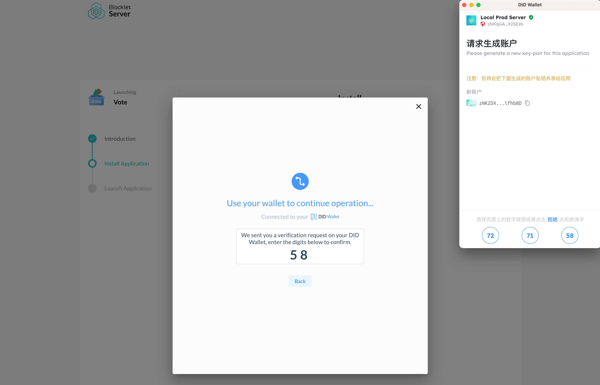
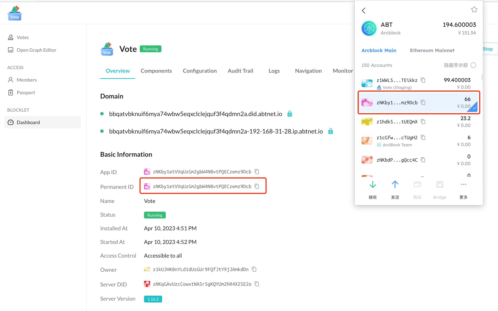
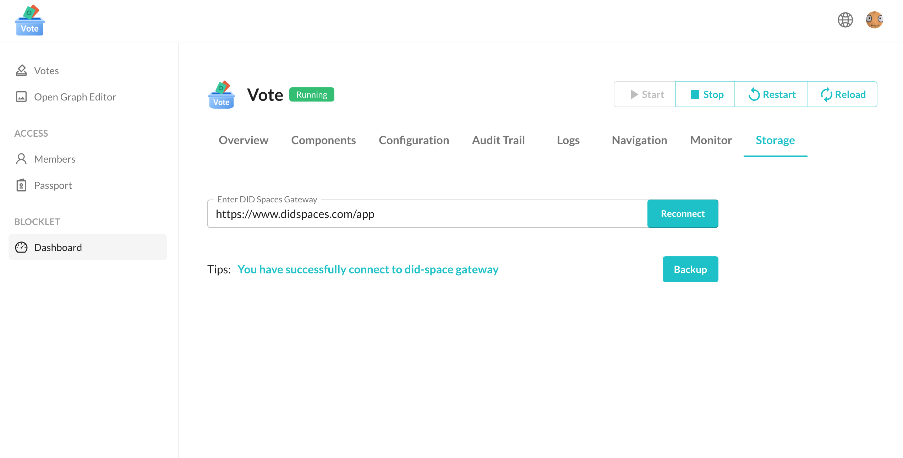
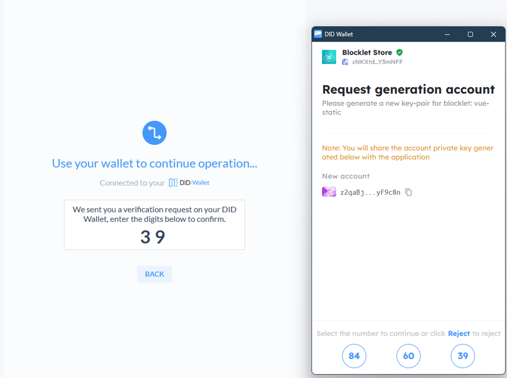

Blocklet Server 1.16.0 正式发布，本次更新将应用概念置于核心地位，从应用的 DID 管理、资产管理、数据备份、应用迁移和应用结构等方面对 Blocklet 进行全面升级。我们旨在提供更加智能、灵活、安全和便捷的应用体验，让用户和开发者更加自由地发挥创造力和专注于创作。以下是本次更新的具体内容。

> 获取最新版 Blocklet Server
> 1. 通过 [Blocklet Launcher](https://launcher.arcblock.io/) 获取
> 1. 如果你是开发者，也可通过 `npm install -g @blocklet/cli` 获取. 参考 [入门指南](https://developer.blocklet.io/docs/zh/quick-start)

## 应用 DID 管理整合到 DID Wallet

我们的最新升级将应用的 DID 管理整合到了 [DID Wallet](https://www.didwallet.io/) 中，让用户能够更加轻松和安全地管理自己的应用和链上资产。现在，你可以使用 [DID Wallet](https://www.didwallet.io/) 轻松掌控你的数字生活，从而更加自信和放心地使用区块链应用。

## 使用 DID Spaces 备份和迁移应用

我们为用户引入了 [DID Spaces](https://www.didspaces.com/) 功能，这个功能让用户可以将自己的应用备份到 [DID Spaces](https://www.didspaces.com/) 中，并在需要的时候便捷地将应用迁移到另一个 Blocklet Server 中。甚至可以让用户在不感知 Blocklet Server 存在的情况下，直接将应用的数据备份到 [DID Spaces](https://www.didspaces.com/) 中，然后直接将应用部署到 serverless 环境中。这一改进将极大地提升用户的应用管理和迁移体验，让用户感觉轻松愉悦。

## 应用结构升级

我们还升级了应用结构，全新的应用结构提高了应用的可组合能力、稳定性和性能，为你打造更加灵活的应用组合体验。你现在可以修改任何组件的挂载点，删除任何组件，轻松实现个性化需求，更自由地发挥创造力。

> 为了让运行中的应用受益于上述改进，需要用户对应用做一次 [迁移](https://www.arcblock.io/blog/zh/post/2023/04/04/migrate-blocklet-guide)

## Blocklet 软件 DID 管理整合到 DID Wallet

我们致力于为开发者提供更加便捷的开发和管理体验。我们的最新升级将 Blocklet 软件的 DID 管理整合到 [DID Wallet](https://www.didwallet.io/) 中，使开发者可以更轻松地查看自己的软件售卖和分成所得的收益，帮助开发者专注于创作和优化他们的 Blocklet。让 [DID Wallet](https://www.didwallet.io/) 成为开发者创作和管理 Blocklet 的得力助手。

我们将继续致力于为用户提供最好的产品和服务，让应用和资产管理变得更加简单和方便。我们也会不断为开发者提供更加高效和舒适的开发体验。感谢您一直以来对Blocklet Server的支持和信任，我们欢迎您使用最新版本的Blocklet Server，一起打造更好的未来。